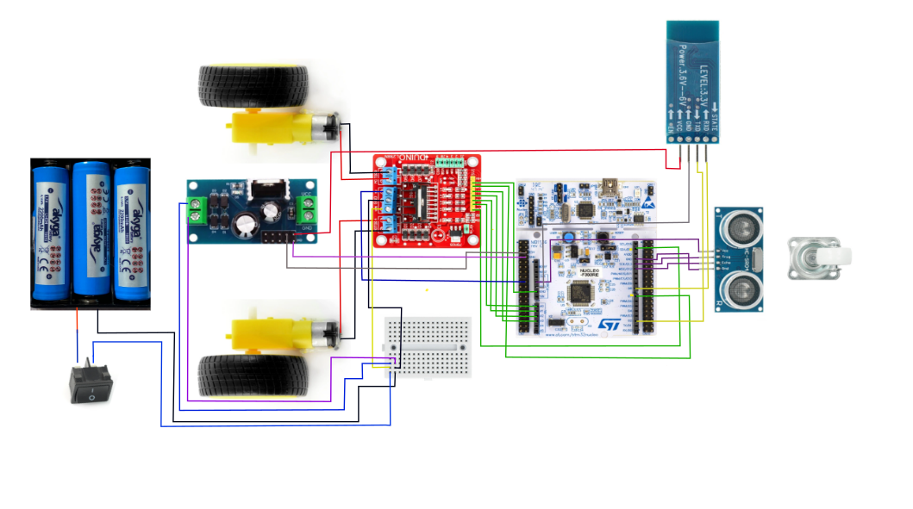

# Opracowanie modelu pojazdu autonomicznego wraz z realizacją oprogramowania sterującego 

Okaaaaaaaay, let`s go!

### Uczestnicy zespołu:
- **Yana Trotsenko** – 21232 🐱  
- **Zofia Głowacka** – 21234 🐻   
- **Valeriia Khylchenko** – 21279 🐿️ 

---

## Cel projektu

Zaprojektowanie, zbudowanie oraz zaprogramowanie **modelu pojazdu autonomicznego** z wykorzystaniem mikrokontrolera **STM32**.

---

## Założenia konstrukcyjne pojazdu

| Komponent                           | Opis                                      |
|-------------------------------------|-------------------------------------------|
| STM32F303RET6                       | Płytka główna                             |
| L298N                               | Dwukanałowy sterownik silników            |
| LM7805                              | Stabilizator napięcia                     |
| Silniki 5V                          | Napęd                                     |
| Baterie 3.7V × 3                    | Zasilanie                                 |
| HC-05                               | Moduł Bluetooth                           |
| HC-SR04                             | Ultradźwiękowy czujnik odległości         |

---

 **Serce projektu - STM32F303RET6**:  

---

## Połączenia

### Koła i silniki:
- Motor A+ --> VIN
- Motor A- --> GND
- Motor B+ --> VIN
- Motor B- --> GND

### Sterownik L298N do płytki STM32:
- IN1 --> PA0 (A0)
- IN2 --> PA1 (A1)
- IN3 --> PA4 (A2)
- IN4 --> PB1 (A3)
- ENA --> PB9 (D14)
- ENB --> PA8 (D7)

### Stabilizator napięcia LM7805:
- VCC stabilizatora --> VMS (12V) na sterowniku
- GND stabilizatora --> GND sterownika
- GND sterownika --> GND płytki
- VCC stabilizatora --> VIN płytki
- GND stabilizatora --> GND płytki

### Czujnik odległości HC-SR04:
- Trig --> PA5 (D13)
- Echo --> PA6 (D12)
- VCC --> 5V
- GND --> GND

### Bluetooth HC-05:
- VCC --> VCC z LM7805
- GND --> GND (CN11 na płytce)
- TXD --> PA10 (D2)
- RXD --> PA9 (D8)

## Konfiguracja mikrokontrolera w STM32CubeIDE

### Sterownik silników L298N

| Nazwa sygnału | Pin STM32 | Oznaczenie | Konfiguracja        |
|---------------|-----------|------------|----------------------|
| IN1           | PA0       | A0         | GPIO Output          |
| IN2           | PA1       | A1         | GPIO Output          |
| IN3           | PA4       | A2         | GPIO Output          |
| IN4           | PB1       | A3         | GPIO Output          |
| ENA           | PB9       | D14        | Timer4 CH4 (PWM Out) |
| ENB           | PA8       | D7         | Timer1 CH1 (PWM Out) |

**Ustawienia PWM dla ENA i ENB:**
- Prescaler: `71`
- Counter Period: `999`  
(Daje częstotliwość PWM ok. 1 kHz przy SYSCLK = 72 MHz)

---

### Czujnik ultradźwiękowy HC-SR04

| Nazwa sygnału | Pin STM32 | Oznaczenie | Konfiguracja   |
|---------------|-----------|------------|----------------|
| Trig          | PA5       | D13        | GPIO Output    |
| Echo          | PA6       | D12        | GPIO Input     |

---

### Moduł Bluetooth HC-05

| Nazwa sygnału | Pin STM32 | Oznaczenie | Konfiguracja   |
|---------------|-----------|------------|----------------|
| TXD (HC-05)   | PA10      | D2         | USART1_RX      |
| RXD (HC-05)   | PA9       | D8         | USART1_TX      |

**Ustawienia UART (USART1):**
- Baud rate: `9600`
- Data bits: `8`
- Parity: `None`
- Stop bits: `1`

---

### Konfiguracja zegara (Clock Configuration)

- PLL: **Włączony**
- SYSCLK: **72 MHz**

## Link do repozytorium 
[Zobacz repozytorium na GitHubie](https://github.com/yunayana/Projekt_SWiM_2025)

