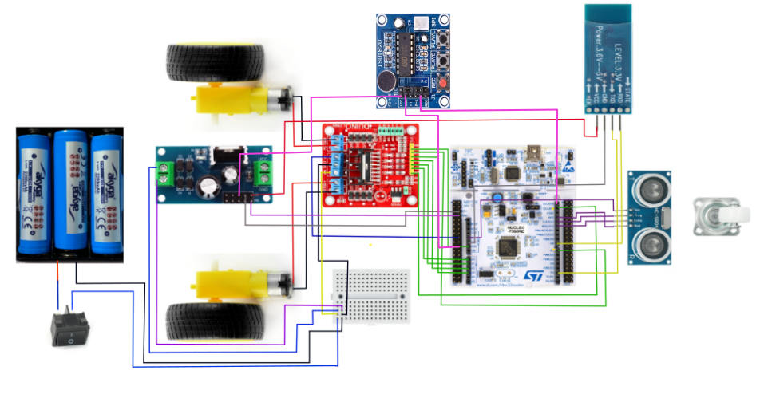
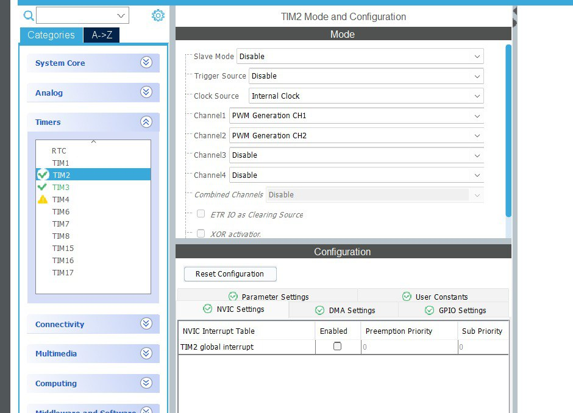

# Opracowanie modelu pojazdu autonomicznego wraz z realizacją oprogramowania sterującego 

## Model pojazdu z użyciem STM32F303RET6, czujnikiem HC-SR04 oraz sygnalizacja ISD1820

Pojazd porusza się do przodu, dopóki czujnik ultradźwiękowy (HC-SR04) nie wykryje przeszkody w odległości mniejszej niż 20 cm. Gdy wykryje przeszkodę:

Natychmiast się zatrzymuje.

Moduł dźwiękowy ISD1820 zostaje aktywowany i odtwarza nagraną wcześniej frazę:
🗣️ „Muszę dowieźć kwiatki!”

Po wypowiedzeniu komunikatu:

pojazd cofa się przez 1 sekundę, aby oddalić się od przeszkody,

następnie skręca w losowym kierunku (w lewo lub w prawo),

po skręcie ponownie rusza do przodu i cały cykl się powtarza.

|  |  |  |
|------------------------|------------------------|------------------------|

### Uczestnicy zespołu:
- **Yana Trotsenko** – 21232  
- **Zofia Głowacka** – 21234   
- **Valeriia Khylchenko** – 21279 

---

## Cel projektu

Zaprojektowanie, zbudowanie oraz zaprogramowanie **modelu pojazdu autonomicznego** z wykorzystaniem mikrokontrolera **STM32**.

---

## Założenia konstrukcyjne pojazdu

| Komponent                           | Opis                                      |
|-------------------------------------|-------------------------------------------|
| STM32F303RET6                       | Płytka główna                             |
| L298N                               | Dwukanałowy sterownik silników            |
| LM7805                              | Stabilizator napięcia                     |
| Silniki 5V                          | Napęd                                     |
| Baterie 3.7V × 3                    | Zasilanie                                 |
| HC-05                               | Moduł Bluetooth                           |
| HC-SR04                             | Ultradźwiękowy czujnik odległości         |
| ISD1820                             | Moduł nagrywania i odtwarzania dźwięku    |
---

 **Serce projektu - STM32F303RET6**:  

---

## Połączenia

| Komponent             | Pin Komponentu | Połączenie z STM32 / Zasilaniem        |
|-----------------------|----------------|-----------------------------------------|
| **Silniki (poprzez L298N)** | Motor A+          | VIN                                     |
|                       | Motor A-          | GND                                     |
|                       | Motor B+          | VIN                                     |
|                       | Motor B-          | GND                                     |
| **Sterownik L298N**   | IN1               | PA0 (A0)                                |
|                       | IN2               | PA1 (A1)                                |
|                       | IN3               | PA4 (A2)                                |
|                       | IN4               | PB1 (A3)                                |
|                       | ENA               | PB9 (D14)                               |
|                       | ENB               | PA8 (D7)                                |
| **Stabilizator LM7805** | Wejście VCC       | VCC z baterii → pierwszy rząd płytki    |
|                       | Wejście GND       | GND z baterii → drugi rząd płytki       |
|                       | Wyjście VCC       | E5V, VCC Bluetooth                      |
|                       | Wyjście GND       | GND płytki                              |
| **Czujnik HC-SR04**   | Trig              | PA5 (D13)                               |
|                       | Echo              | PA6 (D12)                               |
|                       | VCC               | 5V                                      |
|                       | GND               | GND                                     |
| **Bluetooth HC-05**   | VCC               | VCC z LM7805                            |
|                       | GND               | GND (CN11 na płytce)                    |
|                       | TXD               | PA10 (D2)                               |
|                       | RXD               | PA9 (D8)                                |
| **Zasilanie z baterii / przycisk** | VCC | VCC pinboard                             |
|                                | GND | GND pinboard    
| **ISD1820**           | VCC               | VCC z LM7805                            |
|                       | GND               | GND                                     |
|                       | PlayE             | PB8 (D15)                               |

## Konfiguracja pinów oraz ustawienia w STM32 CubeIDE

1. Sprawdź piny w dokumentacji do swojej płytki
   

2. Skonfiguruj je w programie
   

3. Ustaw następujące wartości w programie
   

## Zapisz projekt i wygeneruj kod

Utwórz i zapisz projekt w STM32CubeIDE.

Wklej kod z załączonego pliku do funkcji main().

Podłącz płytkę do komputera przez USB, skompiluj projekt i załaduj go do mikrokontrolera.

Odłącz kabel USB, przestaw zworkę w pozycję VIN, a następnie podłącz baterię zgodnie ze schematem.
---

## Kluczowe cześci projektu 

Pomiar odległości (czujnik ultradźwiękowy)

'''void ultrasonic_trigger() {
    HAL_GPIO_WritePin(TRIG_PORT, TRIG_PIN, GPIO_PIN_SET);
    delay_us(10);
    HAL_GPIO_WritePin(TRIG_PORT, TRIG_PIN, GPIO_PIN_RESET);
}'''
📌 Wysyła impuls 10 μs do czujnika ultradźwiękowego.

c
Копіювати код
float get_distance_cm() {
    ultrasonic_trigger();
    uint32_t duration = ultrasonic_read();
    return (duration * 0.034) / 2;
}
📌 Oblicza odległość w centymetrach na podstawie czasu echa.

📌 Główna logika:

mierzy odległość,

jeśli jest bezpieczna – pojazd jedzie prosto,

jeśli wykryto przeszkodę – odtwarza komunikat „Muszę dowieźć kwiatki”, cofa się, skręca i ponownie rusza.

## Link do repozytorium 
[Zobacz repozytorium na GitHubie](https://github.com/yunayana/Projekt_SWiM_2025)

